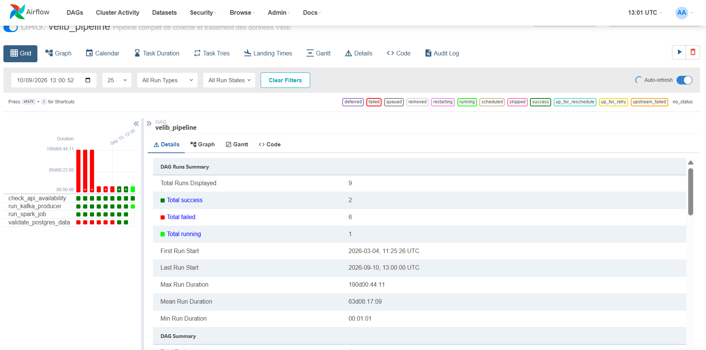
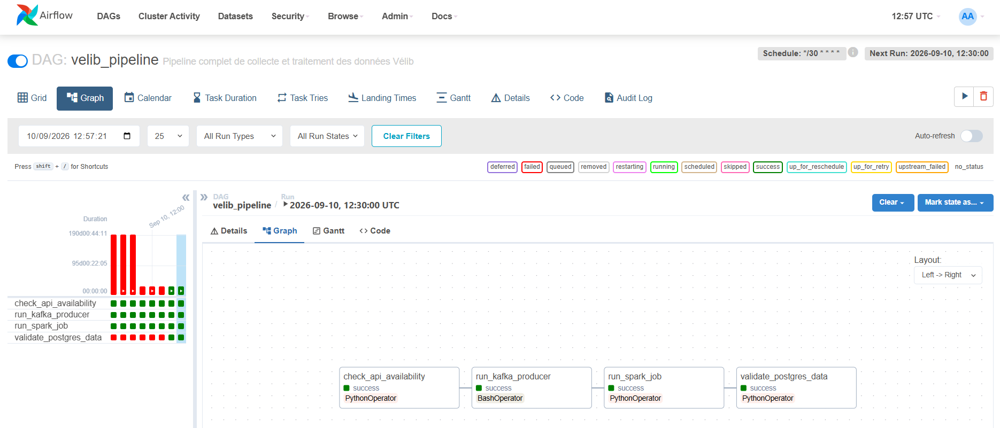
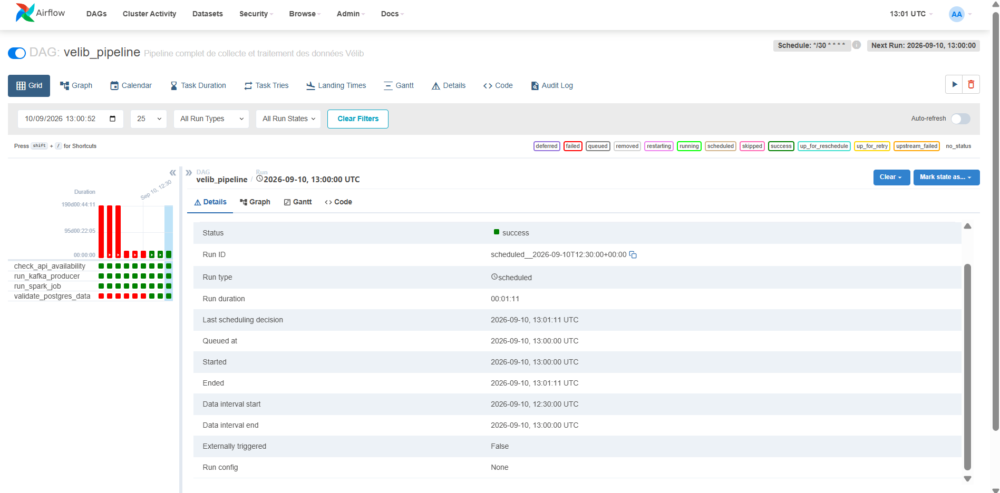
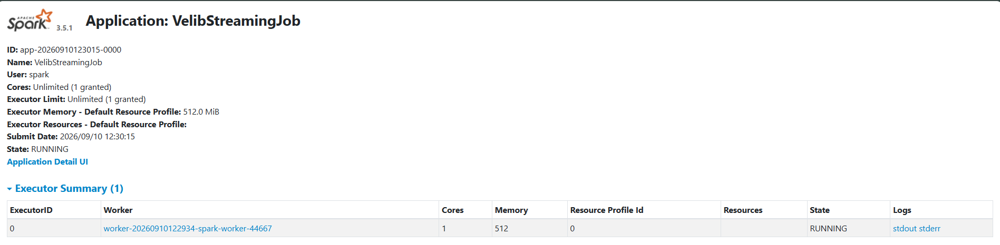
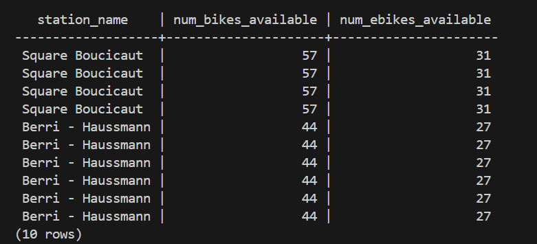
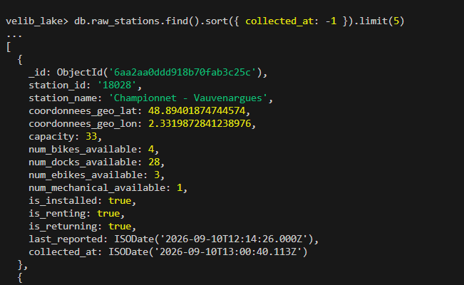
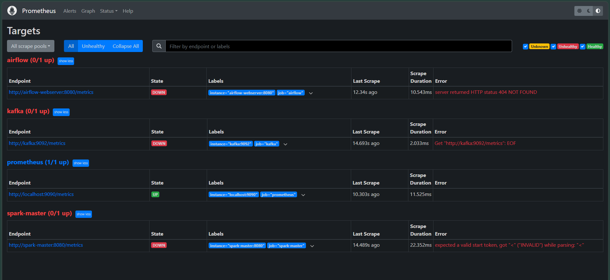

# Rapport d'analyse — Pipeline Vélib

Ce rapport rassemble les captures d'écran des résultats du pipeline, de son
fonctionnement et des DAGs Airflow. Pour le détail des étapes d'installation
et d'exécution, voir le [README](../README.md) à la racine du dépôt.

---

## 1. DAG Airflow — vue d'ensemble

_Capture attendue : `docs/images/01-dag-grid.png`_
Interface Airflow (http://localhost:8082), écran **Grid** du DAG
`velib_pipeline`, montrant l'historique des exécutions et le statut de
chaque tâche (`check_api_availability`, `run_kafka_producer`,
`run_spark_job`, `validate_postgres_data`).

---

## 2. DAG Airflow — graphe des tâches

_Capture attendue : `docs/images/02-dag-graph.png`_
Écran **Graph** du DAG, montrant l'enchaînement
`check_api → kafka_producer → spark_job → validate`.

---

## 3. Détail d'une exécution réussie

_Capture attendue : `docs/images/03-dag-run-success.png`_
Détail d'un run terminé avec succès (toutes les tâches en vert), avec les
logs de la tâche `validate_postgres_data` montrant le nombre
d'enregistrements validés.

---

## 4. Spark — cluster actif

_Capture attendue : `docs/images/04-spark-ui.png`_
Interface Spark Master (http://localhost:8083) montrant le worker
enregistré et le job `VelibStreamingJob` en cours d'exécution (Running
Applications).

---

## 5. Résultats — PostgreSQL

_Capture attendue : `docs/images/05-postgres-resultats.png`_
Résultat d'une requête SQL sur `stations_velib` et/ou `stats_horaires`
(voir requêtes fournies dans le README) montrant les données réellement
collectées et agrégées.

---

## 6. Résultats — MongoDB (Data Lake)

_Capture attendue : `docs/images/06-mongodb-resultats.png`_
Contenu de la collection `raw_stations` dans la base `velib_lake`,
montrant les données brutes stockées telles que reçues de Kafka.

---

## 7. Monitoring (Prometheus / Grafana)

_Capture attendue : `docs/images/07-monitoring.png`_
Écran Prometheus (http://localhost:9090/targets) et/ou Grafana
(http://localhost:3000). Voir la section "Limites connues" du README :
les exporters de métriques Kafka/Spark/Airflow ne sont pas configurés
dans ce projet, cette capture documente donc l'état de la stack de
supervision telle que livrée.

